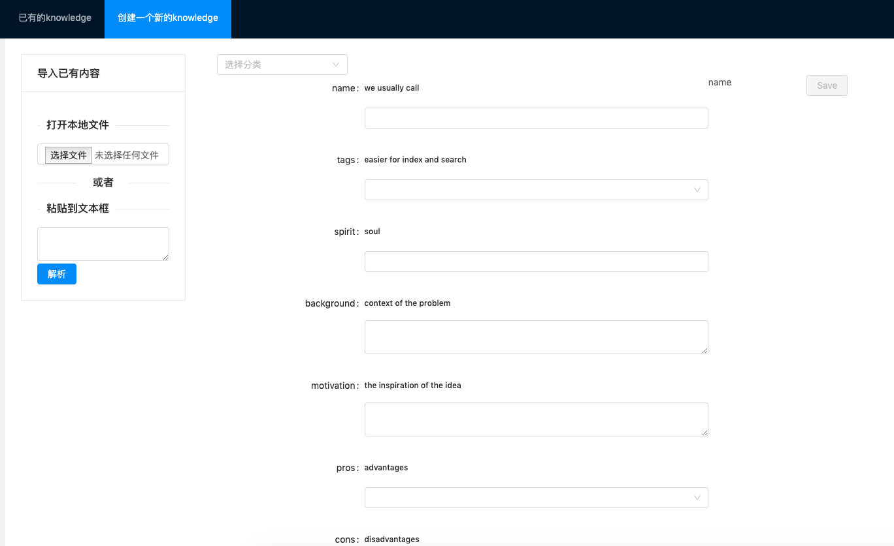
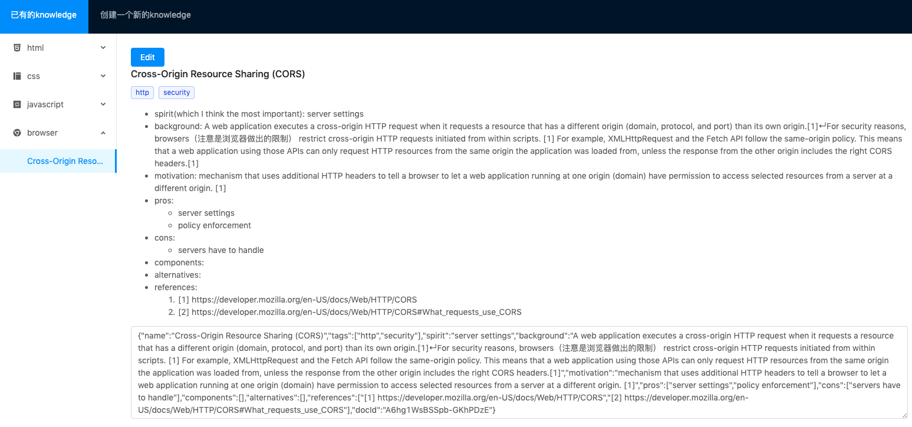

# MyLearningTool

This repository is the front end part of my learning-tool project.

## Motivation

The idea of building such a tool came from [the column article(左耳听风-97 | 高效学习：深度，归纳和坚持实践)](https://time.geekbang.org/column/article/14360) I subscribed (it's written in Chinese).
The author proposed a "learning template", which I think will benefit me a lot.
The template consists of several questions he suggests you ask when learning something new, such as, the background & motivation | alternatives | pros & cons(trade-off) of the technology.
Then I thought, why not build a tool with that template so that you can ask those questions by "fill out forms" and manage all your notes like a knowledge base? Then I built this project.

These are two screenshots about what the user interface looks like:
>The editor

> The list

## Contribute
If you have some suggestions, open an issue or email me at helnawang@hotmail.com.

## Dependencies
* [Angular](https://angular.io)
* [NG-ZORRO(Ant Design of Angular)](https://ng.ant.design/docs/introduce/en)
